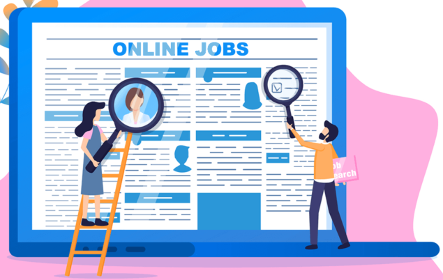

 # Career Services Application

  

## Table of Contents
<!--ts-->
   * [Description of the Project](#description-of-the-project)
   * [Team Members and Roles](#team-members-and-roles)
   * [Project Approach and Technology](#project-approach-and-technology)
   * [Technologies Used](#technologies-used)
   * [Conclusion](#conclusion)

## Description of the Project

The Career Services Application is an advanced online platform designed to offer a comprehensive career services experience for job-seeking candidates and employers alike. This robust system allows students to create and regularly update their portfolios while enabling employers to effortlessly post job openings. By leveraging this platform, users can efficiently search for and connect with potential job opportunities and candidates, thereby streamlining the job headhunting process. The system significantly enhances the job-seeking experience by empowering candidates to customize their profiles according to market demands, while enabling employers to easily shortlist potential employees based on their specific requirements.

## Team Members and Roles

| Name                        | GitHub Username             | Email Address               | Role/Strengths        |
|-----------------------------|-----------------------------|-----------------------------|-----------------------|
| Anurag Agarwal               | [@anuragagarwal6895][1]     | anuragarwal6895@gmail.com   |    Scrum Master                   |
| Shrey Satish Agrawal        | [@Shrey1002][2]             | shrey618@gmail.com          |      QA Analyst/ Software Developer                |
| Aksharkumar Yogeshkumar Patel | [@aksharpatel17][3]        | axarpatel01@gmail.com       |          Lead Software Developer             |
| Vidhi Vinodbhai Sagathiya   | [@vidhisagathiya][4]        | vidhisagathiya028@gmail.com | Product Owner                     |
| Sagar Sanghani              | [@Sagar7421][5]             | sasagarsa1998@gmail.com     |   Software Architect                    |
| Karnik Shah                 | [@KarnikShah][6]            | shahkarnik12@gmail.com      | Design Analyst/ Software Developer |

[1]: https://github.com/anuragagarwal6895
[2]: https://github.com/Shrey1002
[3]: https://github.com/aksharpatel17
[4]: https://github.com/vidhisagathiya
[5]: https://github.com/Sagar7421
[6]: https://github.com/KarnikShah

## Technologies Used:

**Frontend:**

- HTML, CSS, JavaScript, ReactJS

**Backend:**

- NodeJS

**Database:**

- MongoDB

## Project Approach

Our project, "CareerConnect" (Web-Application for Career Service) employs an adaptable approach to software development and will use agile methodology to manage all project operations. Scrum Methodology is the best agile approach for our project's development, taking into account the needs of the client and the project's limitations. Some of the main steps followed in this approach are:

**Planning and Research**

- We will begin by learning about related career websites and comprehending the features and functionality that are frequently there.

**Website Sketch**

- To specify the layout, user flow, and general look and feel of the website, we will build wireframes and mockups. A user-friendly interface will be created while also keeping the user experience in mind.

**Designing User Interface**

- To make the website's UI responsive and user-friendly, we'll use HTML, CSS, and JavaScript. This must have login, registration, job search, and profile pages for candidates and employers.

**Implementing Authentication and Authorization System**

- A secure authentication and authorization mechanism for the website will be implemented using Node.Js. Functions for CRUD operations on user accounts and passwords should be included in this.

**Creating Database**

- A database will be made using MongoDB to hold user and job data. Tables must be made for users, jobs, and applications.

**Testing Website**

- After all the features have been included, we will extensively test the website to make sure everything is working as it should and that there are no security flaws.

**Deploying Website**

- We may employ a hosting service to launch the website once it has undergone testing and is ready.

## Core Features

**Feature 1: User Registration and Login**

- User registration: Employers, students, and admin can create an account by providing their basic information such as name, email, and password.
- Login: Users can securely log in to the platform using their registered email and password.

**Feature 2: Employer Profile Management**

- Profile creation: Employers can create their profiles by entering their company information, industry, and contact details.
- Job offer management: Employers can add job offers, including detailed descriptions of the positions available, required qualifications, and application instructions.
- Candidate browsing: Employers can browse through candidate profiles and resumes to find suitable candidates for their job offers.
- Candidate selection: Employers can select candidates who have already applied for a job offer and shortlist them for interviews.
- Post tracking: Employers can track the status of their job postings, including the number of views, applications, and the progress of the hiring process.

**Feature 3: Student/Candidate Profile Management**

- Profile creation: Students can create their profiles by entering their personal details, educational background, work experience, skills, and achievements.
- Resume upload: Students can build and upload their resumes to make them accessible to potential employers.
- Job offer browsing: Students can browse through job offers posted by employers.
- Application tracking: Students can track the status of their job applications and view any updates from employers.

**Feature 4: Admin Dashboard**

- User management: The admin can manage user profiles.
- Posting Management: The admin can monitor and manage job postings, including approving, editing, or removing posts.
- Application tracking: The admin can track and manage the status of job applications, assisting with the selection process.

**Feature 5: Notifications and Communication**

- Job offer notifications: Employers receive notifications when students apply to their job offers, allowing them to promptly review and respond to applications.
- Interview notifications: Students receive notifications when they are invited for interviews by employers, enabling them to prepare accordingly.
